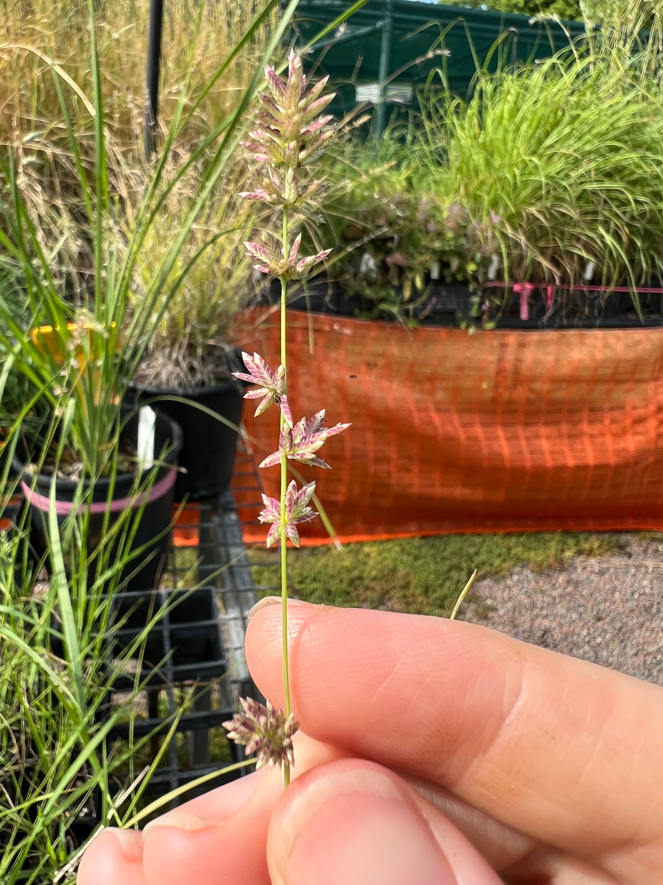

This is some text before the script. 2

# Ergrostis elongata
Clustered Lovegrass

## Natural Occurence
A local grass, often in/near alluvial, well-watered habitats. Also in disturbed sites, beach dunes, & rocky gullies.
## Appearance:
Tufted annual or short-lived perennial (20-90cm) with purplish-green flower/seed heads (Dec-Mar). Tiny flowers in compact, interrupted clusters along axis. Flowers and fruits after rain.
## Growth Conditions:
Grows in full sun/light shade, & wide range of soil types. Tolerates poor soil. Drought- & frost-tolerant.
## Distirctive Features: 
Attractive In mass plantings. Produces many, fast- germinating seeds, so spreads quickly on revegetation sites - used as cover plant for slower growing native: grasses. Finches eat the seeds. 
## Botanical Family: POACEAE
